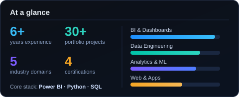

<!-- ===================== BESPOKE 3D HERO ===================== -->
<p align="center">
  
</p>

<!-- ===================== TYPING TAGLINE ===================== -->
<p align="center">
  <a href="https://github.com/syedjawaadali">
    
  </a>
</p>

<!-- ===================== BADGES ===================== -->
<p align="center">
  
  
  
  
  
</p>

<p align="center">
  <a href="https://www.linkedin.com/in/syedjawaadali"></a>
  <a href="https://syedjawaadali.github.io/CV"></a>
  <a href="https://syedjawaadali.github.io/meridian-analytics/"></a>
  <a href="mailto:syedjawaadali@gmail.com"></a>
</p>

<br/>

<!-- ===================== ABOUT ===================== -->
## 🧭 About Me

```yaml
name:      Syed Jawaad Ali
role:      Assistant Manager — BI, Reporting & Analytics  |  Senior BI Engineer (consultancy)
education: MS, Data Engineering & Information Management  ·  Finance & Economics foundation
domains:   [ Banking, Telecom, Healthcare, E-Commerce, Public Sector ]
i build:   governed semantic models · executive dashboards · data-quality frameworks · web & mobile apps
i teach:   Power BI · Advanced Excel · Data Modeling & DAX · Analytics
motto:     "Scattered data in — clear decisions out."
```

Data, analytics and reporting leader with **6+ years across Banking, Telecom, Healthcare and
E-Commerce** (3+ in team-lead / managerial roles). I pair deep technical work — semantic
modeling, ETL, governance — with the **financial literacy** to support planning, forecasting
and budgeting, and I ship **web & cross-platform apps** end to end.

- 🔭 Delivering governed **Power BI** semantic models for a UK client; leading BI reporting, planning & analytics.
- 🏛️ I own **data-governance & data-quality** frameworks, KPI standards, and the executive dashboards leadership trusts.
- 🎓 Hands-on **Power BI & Excel trainer** — designed & delivered an 8-week program; mentored analysts into senior roles.
- 💻 I turn ideas into deployed products — see the **live demos** and project showcase below.

<br/>

<!-- ===================== TECH ===================== -->
## 🛠️ Tech &amp; Tools

<table>
<tr>
<td valign="top" width="50%">

**BI & Analytics**


</td>
<td valign="top" width="50%">

**Data Engineering & Databases**


</td>
</tr>
<tr>
<td valign="top" width="50%">

**Programming & Data Science**


</td>
<td valign="top" width="50%">

**Web, Apps & Tooling**


</td>
</tr>
</table>

<br/>

<!-- ===================== FEATURED WORK ===================== -->
## 📌 Featured Work

Every project below is **real and runnable** — sample data, clean code, tests where they count,
and a proper README with visuals.

### 📊 Data, Analytics & BI

<table>
<tr>
<td width="33%" valign="top">

**[retail-sales-analytics](https://github.com/syedjawaadali/retail-sales-analytics)**<br/>
Executive KPI dashboard + insights from 14.6K rows. `pandas` `matplotlib`

</td>
<td width="33%" valign="top">

**[telecom-churn-prediction](https://github.com/syedjawaadali/telecom-churn-prediction)**<br/>
Churn scoring & driver ranking, ROC-AUC 0.72. `scikit-learn`

</td>
<td width="33%" valign="top">

**[etl-pipeline-warehouse](https://github.com/syedjawaadali/etl-pipeline-warehouse)**<br/>
Extract → transform → DQ gate → star schema. `pandas` `SQLite`

</td>
</tr>
<tr>
<td width="33%" valign="top">

**[customer-segmentation-rfm](https://github.com/syedjawaadali/customer-segmentation-rfm)**<br/>
RFM + K-Means; Champions = 30% of revenue. `scikit-learn`

</td>
<td width="33%" valign="top">

**[financial-forecasting](https://github.com/syedjawaadali/financial-forecasting)**<br/>
12-month forecast, backtest MAPE 3.0%. `NumPy` `pandas`

</td>
<td width="33%" valign="top">

**[sql-analytics-portfolio](https://github.com/syedjawaadali/sql-analytics-portfolio)**<br/>
Window functions, cohorts, running totals. `SQL` `SQLite`

</td>
</tr>
<tr>
<td width="33%" valign="top">

**[data-quality-framework](https://github.com/syedjawaadali/data-quality-framework)**<br/>
Chainable pandas rule engine + reporting. `pandas`

</td>
<td width="33%" valign="top">

**[healthcare-analytics](https://github.com/syedjawaadali/healthcare-analytics)**<br/>
Clinical-trial efficacy & safety stats. `SciPy`

</td>
<td width="33%" valign="top">

**[realtime-etl-alerting](https://github.com/syedjawaadali/realtime-etl-alerting)**<br/>
Micro-batch ETL with KPI-breach alerts. `Python`

</td>
</tr>
</table>

### 🌐 Web, Apps & Product

<table>
<tr>
<td width="33%" valign="top">

**[sales-kpi-dashboard](https://github.com/syedjawaadali/sales-kpi-dashboard)**<br/>
Interactive KPI **web app**. `Streamlit`

</td>
<td width="33%" valign="top">

**[meridian-analytics](https://github.com/syedjawaadali/meridian-analytics)** · [live ↗](https://syedjawaadali.github.io/meridian-analytics/)<br/>
Studio site + storefront, dashboard, kanban & 3D demos. `Canvas` `JS`

</td>
<td width="33%" valign="top">

**[CV](https://github.com/syedjawaadali/CV)** · [live ↗](https://syedjawaadali.github.io/CV)<br/>
3D-styled interactive portfolio. `React` `Vite` `Framer Motion`

</td>
</tr>
</table>

> 🧰 **More on the way** — dashboards, Excel models, PowerPoint frameworks and
> performance-management tools across HR, Finance, Marketing, Supply-chain and Ops.

<br/>

<!-- ===================== STATS ===================== -->
## 📈 GitHub Analytics

<p align="center">
  
  
</p>

<p align="center"><sub>Contribution graph</sub></p>
<picture>
  <source media="(prefers-color-scheme: dark)" srcset="https://raw.githubusercontent.com/syedjawaadali/syedjawaadali/output/github-contribution-grid-snake-dark.svg" />
  
</picture>

<br/>

<!-- ===================== TRAINING & CERTS ===================== -->
## 🎓 Training, Mentoring &amp; Certifications

> **Power BI & Business-Analysis trainer** — I take mixed-ability learners from raw
> data to portfolio-ready dashboards through hands-on, project-based instruction, in
> **English & Urdu**.

| Program | Where | When |
|---|---|---|
| **"Dashboards using Power BI & Excel"** · 8-week instructor-led | Khair ul Amal Education Center — Karachi | 2026 |
| **Advanced Excel & Tableau** · 1-week intensive | TGD Services DMCC — Dubai | 2024 |
| **Power BI Workshop** · 2-day, call-center analytics | Habib Bank Limited (HBL) — Karachi | 2023 |
| **Excel, PowerPoint & Tableau** · 1-week | Data n Dashboard — Karachi | 2021 |
| **Analyst mentorship & team capability building** | Across analytics roles — Karachi / Remote | 2019 – present |

**Modules I teach** &nbsp; `Excel for Analysis` `Power BI Foundations` `Data Modeling & DAX` `Visualization & Design` `Publishing & Governance (RLS)` `Tableau` `SQL` `AI for Data Analysis` `Business Analysis`

### 🎓 Education
- **M.S. — Data Engineering & Information Management** · NED University of Engineering & Technology · 2021–2024
- **B.S. — Economics & Finance** · NED University of Engineering & Technology · 2016–2020
- **Final-year project:** *Blockchain, Fintech & Digitalization in Pakistan's Emerging Market* — assessed small-business readiness for **blockchain-based business registration** through an in-person survey, with descriptive statistics & opportunity forecasting in **SPSS & Excel** to inform government policy _(2020)_.
- **Research:** *Implementation of Blockchain in Pakistan's Banking Sector* — qualitative, interview-based **thematic analysis** across banking, government, public & specialist perspectives _(2019)_.

### 📜 Certifications
`IBM Data Science Professional` · `Google Business Intelligence Specialization` · `Business Intelligence for Consultants` · `Prompt Engineering for Professionals` &nbsp;·&nbsp; **In progress:** `Microsoft PL-300` · `Microsoft Certified Trainer (MCT)` · `MOS Specialist`

<br/>

<!-- ===================== FOOTER ===================== -->
<p align="center">
  
</p>
<p align="center"><i>Turning data into decisions — and ideas into working products.</i></p>
